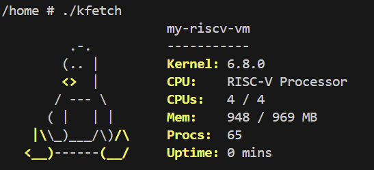

# OS Course Repository

## Overview
This repository contains my coursework and homework for the Operating Systems course.

## Contents
- HW1: Compiling a Custom Linux Kernel and Implementing New System Calls
- HW2: Scheduling Policy Demonstration Program
- HW3: System Information Fetching Kernel Module

## Homework Summary
- HW1: Learned how to use Docker, manage containers, use SSH, compile a custom Linux kernel, run a RISC-V Linux system with QEMU, and implement new system calls.
- HW2: Implemented a program that applies different scheduling policies to created threads and observes their behaviors.
- HW3: Implemented a kernel module that fetches system information from the kernel.

## Skills
- Linux Kernel Development
- System Calls
- Kernel Modules
- Docker
- SSH
- QEMU
- RISC-V
- Thread Scheduling

## Notes
Some large files, videos, and archives are excluded from this repository.